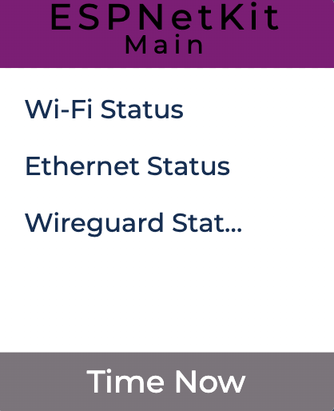
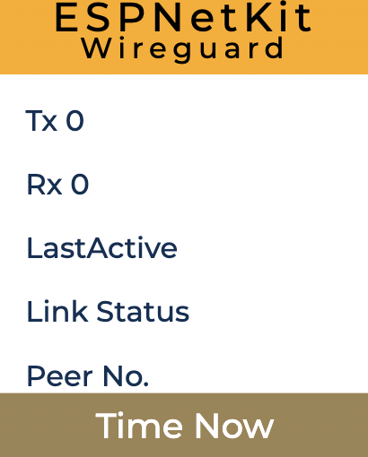
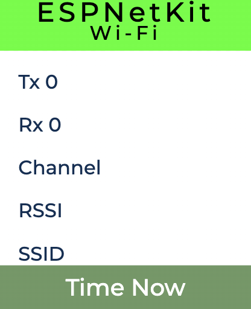

# Network Status Interface for ESP32

This project is a multi-page network status interface for WireGuard, Ethernet, and Wi-Fi, designed and implemented using GUI-BUILDER for the ESP32 platform.

## Features

- **WireGuard Status**: Displays connection status, IP address, and other relevant information. WireGuard has been ported to the ESP32 platform as part of this project.
- **Ethernet Status**: Shows connection status, IP address, and detailed Ethernet statistics.
- **Wi-Fi Status**: Provides Wi-Fi connection details, signal strength, and network information.

## Getting Started

### Prerequisites

- **ESP32 Development Board**
- **GUI-BUILDER Software**
- **ESP32-IDF Development Environment**

### Installation

1. Clone the repository:
    ```sh
    git clone https://github.com/chinawrj/espnetkit.git
    cd espnetkit
    ```

2. Set up the ESP32-IDF environment as per the [official guide](https://docs.espressif.com/projects/esp-idf/en/latest/esp32/get-started/index.html).

3. Build and flash the firmware to your ESP32 development board:
    ```sh
    idf.py build
    idf.py flash
    ```

4. Monitor the serial output to verify the status:
    ```sh
    idf.py monitor
    ```

## Usage

Once flashed, the device will start displaying network status information on the connected display. Use the buttons to navigate between the WireGuard, Ethernet, and Wi-Fi status pages.

## Screenshots

Screenshots of the UI can be found in the `docs` directory of this repository. Below are some examples:






## Contributing

Contributions are welcome! Please submit a pull request or open an issue to discuss any changes.

## License

This project is licensed under the MIT License. See the [LICENSE](LICENSE) file for details.

## Acknowledgements

- **Espressif Systems** for the ESP32 platform and ESP-IDF.
- **LVGL** for the GUI-BUILDER tool.
- **FreeRTOS** for the real-time operating system.

## Contact

For any questions or support, please open an issue or contact me at chinawrj#gmail.com.
